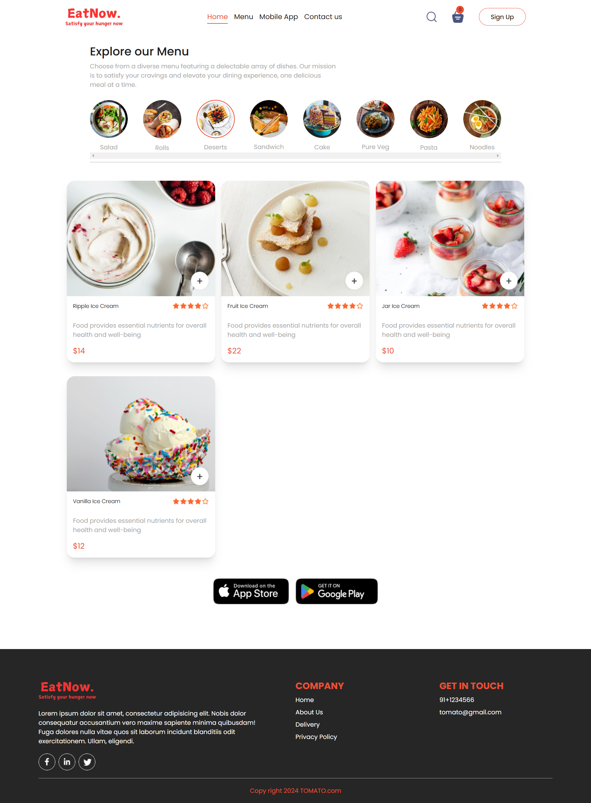
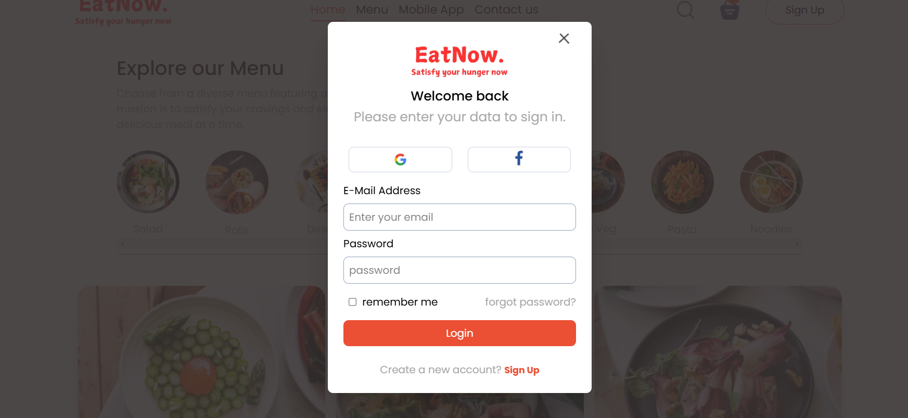
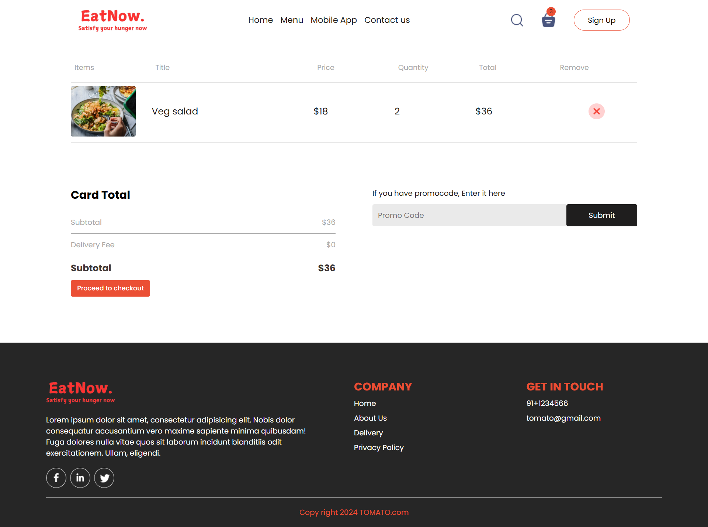
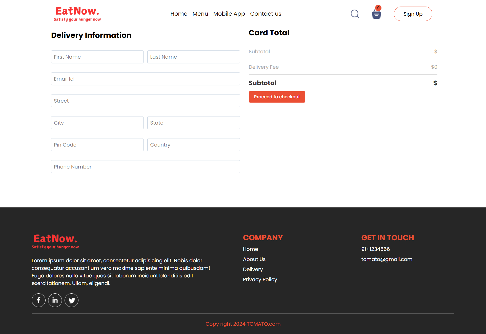

# EatNow - Food Preordering System

EatNow is a **food preordering system** designed for students to order meals from the canteen before their break. Payments are made in advance, and after some time, students receive their orders. The system also includes an **admin panel** for managing the menu and orders efficiently.

## Screenshots







## Features

- **Student Panel**:
  - Preorder food before break time.
  - Pay before or after ordering.
  - Receive notifications when the order is ready.
  
- **Admin Panel**:
  - Dashboard with order statistics.
  - Menu management (add/edit/delete items).
  - Order management (track and update order status).

## Tech Stack

- **Frontend**: React, Redux Toolkit, Tailwind CSS
- **Backend**: Node.js, Express.js, MongoDB
- **Authentication**: JWT-based authentication
- **Database**: MongoDB with Mongoose ORM

## Installation

### Prerequisites

Ensure you have the following installed:

- [Node.js](https://nodejs.org/)
- [MongoDB](https://www.mongodb.com/try/download/community)

### Clone the Repository

```sh
git clone https://github.com/your-username/EatNow.git
cd EatNow
```

### Install Dependencies

#### Backend

```sh
cd server
npm install
```

#### Frontend

```sh
cd client
npm install
```

### Environment Variables

Create a `.env` file in the `server` directory and add:

```env
PORT=5000
MONGO_URI=your_mongodb_connection_string
JWT_SECRET=your_jwt_secret
```

### Run the Application

#### Start Backend

```sh
cd server
npm run dev
```

#### Start Frontend

```sh
cd client
npm start
```

## API Endpoints

### Authentication

- `POST /api/auth/register` - Register a new user
- `POST /api/auth/login` - Login user and get token

### Orders

- `GET /api/orders` - Fetch user's orders
- `POST /api/orders` - Place a new order
- `PUT /api/orders/:id` - Update order status

### Admin

- `GET /api/admin/menu` - Fetch menu items
- `POST /api/admin/menu` - Add new menu item
- `DELETE /api/admin/menu/:id` - Remove menu item


## License

This project is licensed under the **MIT License**.

## Contact

For questions or suggestions, reach out at **your-email@example.com**.

